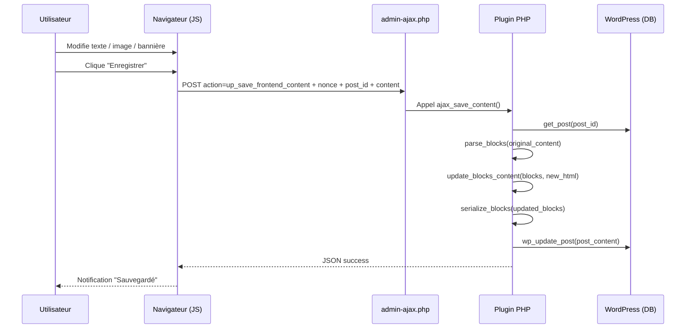

# UP Frontend Editor — Fonctionnement de l'enregistrement en front

Ce document explique, de bout en bout, comment l'éditeur front sauvegarde les modifications (texte, titre, images, bannières) sans casser la structure Gutenberg.

## Vue d'ensemble

- Le front collecte le HTML modifié depuis `div.up-editable-content` et le titre depuis `span.up-editable-title`.
- Les requêtes partent via `admin-ajax.php` (pas l'API REST) avec un `nonce`.
- Côté serveur, on nettoie le HTML d'édition, on parse les blocs Gutenberg existants, on applique les changements dans l'ordre, puis on re-sérialise les blocs et on met à jour le post.



## Côté client (JavaScript)

Fichiers clés:
- `assets/js/frontend-editor-new.js` (point d'entrée, modules ES6)
- `assets/js/core/editor-manager.js` (orchestrateur, bouton Enregistrer/Annuler, gestion des changements)
- `assets/js/utils/ajax-handler.js` (requêtes AJAX vers `admin-ajax.php`)
- Handlers de blocs: `blocks/text-blocks.js`, `blocks/image-block.js`, `blocks/cover-block.js`, `blocks/title-block.js`

Points importants:
- Le HTML envoyé est `document.querySelector('.up-editable-content').innerHTML`.
- Les images remplacées portent temporairement un `data-attachment-id` et conservent la classe `wp-image-123`.
- Les bannières (cover) mettent à jour `style="background-image:url(...)"` sur `.wp-block-cover__image-background` et `data-attachment-id`.
- Le titre est envoyé à part (action `up_save_page_title`) si modifié.

Extrait simplifié du flux JS (`EditorManager.save()`):
```js
// 1) Sauver le titre si changé
ajax.saveTitle(newTitle)
// 2) Sauver le contenu HTML
ajax.saveContent(contentElement.innerHTML)
```

## Côté serveur (PHP)

Fichier: `up-frontend-editor.php`

Hooks:
- `add_action('wp_ajax_up_save_frontend_content', [$this, 'ajax_save_content']);`
- `add_action('wp_ajax_up_save_page_title', [$this, 'ajax_save_page_title']);`

### 1) Sauvegarde du titre
`ajax_save_page_title()`
- Vérifie `nonce` + capabilities.
- `wp_update_post(['post_title' => $new_title])`.

### 2) Sauvegarde du contenu
`ajax_save_content()`
- Vérifie `nonce` + capabilities.
- Récupère `post_id` et `content` (innerHTML de `.up-editable-content`).
- Sanitize avec `wp_kses()` en autorisant des attributs nécessaires:
  - `style`, `class`, `data-attachment-id` (pour identifier bannières/images)
  - `srcset`, `sizes` pour ``
- Nettoyage d'édition via `clean_content($html)`:
  - Retire boutons d'édition (`.up-image-edit-btn`, `.up-cover-edit-btn`)
  - Retire wrappers (`<span class="up-image-wrapper">`)
  - Retire `contenteditable`, classes `up-editable*`, `data-attachment-id`
  - Ne retire plus de `</div>` (évite de casser le HTML)
- Récupère le contenu original du post.
- Si Gutenberg: `parse_blocks($original_content)` puis `update_blocks_content($blocks, $new_html)` → `serialize_blocks($updated_blocks)` → `wp_update_post()`.

## Mise à jour du contenu des blocs (coeur du système)

Fichier: `up-frontend-editor.php`

Fonctions clés:
- `update_blocks_content($blocks, $new_html)`
  - Parse le nouveau HTML (`DOMDocument`)
  - Extrait une liste ordonnée des éléments de contenu avec `extract_content_elements()`
  - Lance `update_blocks_recursive()`

- `extract_content_elements($node, &$elements)`
  - Collecte dans l'ordre ces tags: `p`, `h1..h6`, `li`, `blockquote`, `figcaption`, `a`, `img`.
  - Pour chaque élément, garde `{ tag, content }` (le HTML interne).

- `update_blocks_recursive($blocks, $new_elements, &$idx)`
  - Pour chaque bloc:
    1) Met à jour d'abord `innerHTML` via `update_block_html()` en remplaçant séquentiellement le contenu des éléments par ceux de `new_elements`.
    2) Met à jour ensuite `attrs` via `update_block_attributes_from_html()` à partir du `innerHTML` mis à jour.
    3) Si `innerBlocks` → appel récursif.

- `update_block_html($html, $new_elements, &$idx)` et `update_dom_elements()`
  - Remplace, quand le tag courant correspond, le contenu interne par celui de `new_elements[$idx]`, puis incrémente l'index.
  - Gère les `` en copiant `src`, `srcset`, `sizes`, `width`, `height`, `alt`.

- `update_block_attributes_from_html($block, $updated_inner_html)`
  - Reparse le HTML (mis à jour) du bloc.
  - Met à jour les attributs par type de bloc:
    - `core/heading`: `attrs.content` ← texte du premier `h1..h6`.
    - `core/cover`: `attrs.url` et `attrs.id` depuis
      - `.wp-block-cover__image-background[style*="background-image"]` (+ `data-attachment-id` ou `wp-image-123`)
      - ou le premier `` (fallback)
    - `core/media-text`: `attrs.mediaUrl` et `attrs.mediaId` depuis le premier ``.
    - `core/image`: `attrs.url`, `attrs.id`, `attrs.alt`, `attrs.width`, `attrs.height` depuis ``.

> Important: on met à jour d'abord le HTML puis les `attrs` pour garantir que les attributs reflètent bien le nouveau contenu.

## Blocs supportés aujourd'hui

- **Texte**: paragraphes, headings, list items, blockquote, figcaption, liens (texte du lien). Note: la mise à jour de `href` n'est pas encore mappée.
- **Image (`core/image`)**: `url`, `id`, `alt`, `width`, `height`.
- **Cover (`core/cover`)**: image de bannière via background-image (ou `` fallback), `url`, `id`.
- **Media & Text (`core/media-text`)**: `mediaUrl`, `mediaId`.
- **InnerBlocks**: parcours récursif, les éléments textuels et images internes sont mis à jour séquentiellement.

## Points de nettoyage (front → serveur)

- Supprimés: wrappers de boutons, boutons d'édition, classes d'édition, `contenteditable`, `data-attachment-id`.
- Conservés: `style` (pour cover), `class` (y compris `wp-image-123`), attributs d'images (`src`, `srcset`, `sizes`, dimensions, `alt`).

## Sécurité / Permissions

- `check_ajax_referer('up_frontend_editor', 'nonce')` sur chaque appel.
- `current_user_can('edit_posts')` requis.
- Sanitize côté serveur avec `wp_kses()` et liste d'attributs autorisés.

## Débogage — Checklist

- **Activation**: `UP_Frontend_Editor::is_edit_mode_enabled()` est vrai (cookie `up_fe_enabled=1` ou réglage par défaut) et `is_singular()`.
- **Console**: logs `[EditorManager]`, `[text]`, `[image]`, `[cover]`, `[title]`.
- **Réseau**: requêtes `admin-ajax.php`:
  - `action=up_save_frontend_content` → JSON `success: true`
  - `action=up_save_page_title` (si titre modifié) → JSON `success: true`
- **Payload**: `content` doit contenir
  - pour cover: `<div class="wp-block-cover__image-background" style="background-image:url(...)" data-attachment-id="123">`
  - pour image: ``
- **Sanitize**: si `style`/`data-attachment-id` disparaissent dans la requête, vérifier qu'ils ne sont pas filtrés par un plugin de sécurité.
- **Structure**: ne pas changer la structure des blocs (ajout/suppression de blocs) en front — seul le contenu doit changer.

## Problèmes connus et améliorations

- **Liens (`href`)**: le texte des liens est pris en compte, mais pas encore leur URL (on peut l'ajouter dans `update_block_attributes_from_html()` pour `core/button(s)` et `a`).
- **Blocs complexes**: le mapping est séquentiel; si l'ordre visuel diffère de l'ordre HTML, vérifier la structure.
- **Cache**: forcer un hard refresh si les scripts ne se rechargent pas.

## Fichiers impliqués (références)

- `assets/js/core/editor-manager.js` → `save()`, `markChanges()`, UX
- `assets/js/utils/ajax-handler.js` → `saveContent()`, `saveTitle()`
- `assets/js/blocks/*.js` → gestion par type de bloc (UI et modifications DOM)
- `up-frontend-editor.php` → `ajax_save_content()`, `ajax_save_page_title()`
- `up-frontend-editor.php` → `clean_content()`, `update_blocks_content()`, `update_blocks_recursive()`
- `up-frontend-editor.php` → `extract_content_elements()`, `update_block_html()`, `update_dom_elements()`
- `up-frontend-editor.php` → `update_block_attributes_from_html()`

---

Si vous voulez tracer une sauvegarde précise (par ex. cover), donnez-moi la page et je listerai pas-à-pas ce qui est attendu dans la requête et ce que le serveur va modifier.
